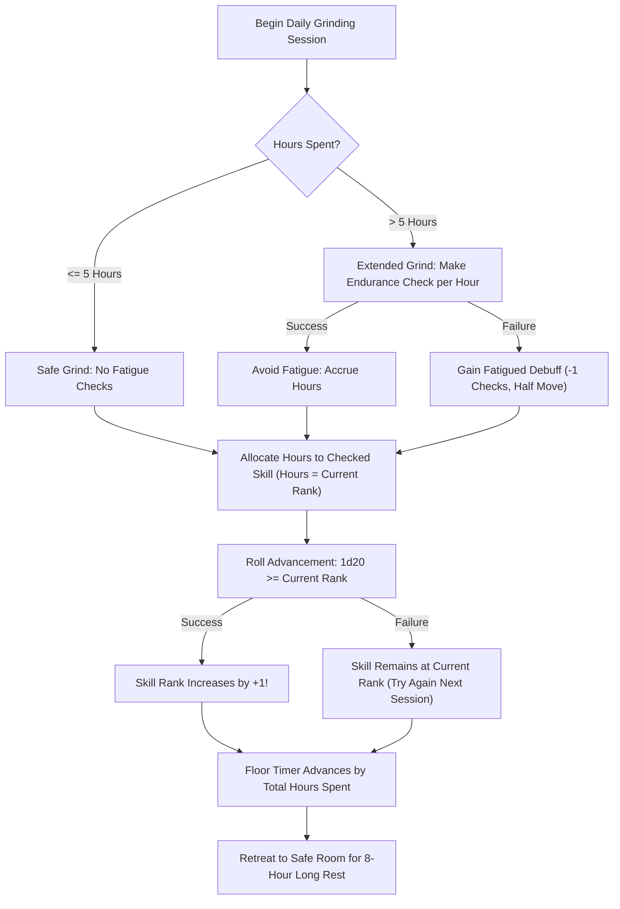

# Dungeon Crawler Carl RPG — Grinding & Skill Advancement Mechanics

## Overview

In the **Dungeon Crawler Carl Roleplaying Game** (published by Renegade Game Studios), **"Grinding"** is an explicit, core gameplay mechanic directly mirroring the LitRPG principles of Matt Dinniman's novels. 

Rather than bogging down sessions with endless, low-stakes combat rolls against trash mobs, CarlRPG provides a streamlined, abstracted **Grinding System**. Crawlers deliberately set aside blocks of in-game time between major story beats to hunt roaming mobs, drill weapon stances, practice spell incantations, and hone their physical and mental skills.

---

## 1. The Core Grinding Rules

### A. The 5-Hour Safe Daily Limit
- A crawler party can safely spend up to **5 hours per in-game day** grinding without penalty.
- During these 5 hours, crawlers are assumed to hunt local mobs, practice techniques, or harvest materials with standard caution.
- No exhaustion checks are required for the first 5 hours.

### B. Extended Grinding & The Endurance Check
Crawlers who choose to push their limits and grind past the 5-hour safe threshold risk physical and mental exhaustion:
- **Each Hour Past 5**: Every additional hour spent grinding beyond 5 hours requires an **Endurance Skill Check** (Unopposed Constitution-based check: $1d20 + \text{Modified Rank} + \text{CON Mod}$).
- **The DC**: The standard DC for extended grinding fatigue is typically $10 + \text{Floor Number} + (\text{Hours Past 5})$.
- **Endurance Skill Synergy**:
  - The canonical **Endurance** skill specifically notes:
    > *"Prevent fatigue and avoid Fatigued Debuff during long-distance travel and grinding."*
    - **Rank 5**: Ignore the effects of a Major Failure on Endurance checks.
    - **Rank 10**: Roll with Advantage if not already Fatigued.
    - **Rank 15**: Critical Failures are converted to Standard Failures.
- **Fatigued Debuff Penalty on Failure**:
  - Failing the Endurance check inflicts the **Fatigued Debuff** (`type: "debuff"`):
    > *"You have a −1 penalty on all Checks and your Move is halved. Stackable. Until the end of a long rest."*
  - Because Fatigued is **stackable**, continuing to grind while exhausted quickly cripples a crawler's combat efficacy.

### C. The Floor Collapse Clock (Time as a Finite Resource)
- Grinding is never free: every hour spent grinding subtracts directly from the **Time to Floor Collapse** clock.
- If the party spends 5 hours grinding, the floor clock advances by 5 hours.
- Certain enemy abilities (such as *Mind Horror* chatter on Floor 2) or dungeon hazards can drain additional hours from the floor collapse timer if an encounter goes poorly.

### D. Guide & NPC Modifiers
Certain allies, environmental factors, or quest rewards can modify grinding efficiency:
- *Example (Huey, GM Toolkit p. 96)*: Harmonizing with Huey grants insights that make grinding more efficient for the rest of the day, allowing crawlers to **add 1 hour to their grind at no penalty** (raising the safe limit to 6 hours).

---

## 2. Skill Advancement Mechanics

In CarlRPG, skills advance through active use and dedicated grinding time rather than arbitrary class-wide level-ups.

### Step 1: Marking Skills Through Use ("Checked" Flag)
- Whenever a crawler actively uses a skill during an encounter, exploration, or roleplay challenge (regardless of whether the roll succeeds or fails), that skill is marked as **Checked** (`system.checked: true`).
- In the Foundry VTT system, every skill document includes a `checked` boolean flag and a sheet checkbox indicator.

### Step 2: Committing Grinding Hours
- Crawlers allocate their accrued grinding hours toward their skills.
- A crawler can only focus on **one skill per grinding block**.
- **The Hours Requirement**: To attempt to increase a skill's rank, a crawler must commit **a number of grinding hours equal to the skill's current rank**:

$$\text{Required Grinding Hours} = \text{Current Skill Rank}$$

| Current Rank | Target Rank | Required Grinding Hours |
| :---: | :---: | :---: |
| **Rank 0** (Untrained) | **Rank 1** (Trained) | 1 Hour |
| **Rank 1** | **Rank 2** | 1 Hour |
| **Rank 2** | **Rank 3** | 2 Hours |
| **Rank 3** | **Rank 4** | 3 Hours |
| **Rank 4** | **Rank 5** | 4 Hours |
| **Rank 5** | **Rank 6** | 5 Hours |
| **Rank 9** | **Rank 10** | 9 Hours (Requires multiple days/sessions) |
| **Rank 14** | **Rank 15** | 14 Hours |

### Step 3: The Advancement Roll
Once the required grinding hours have been invested into a marked skill, the crawler rolls **1d20** for advancement:

$$\text{Advancement Success Condition: } \mathbf{d20 \ge \text{Current Skill Rank}}$$

- **Success ($\mathbf{d20 \ge \text{Current Rank}}$)**: The skill permanently increases by **+1 Rank**.
  - All derived values (Modified Rank, Total Skill Bonus, To-Hit bonuses, and Rank Damage Dice) update automatically.
  - Crossing milestone thresholds (**Rank 5**, **Rank 10**, **Rank 15**) unlocks new passive perks, extra damage dice, and special effects.
- **Failure ($\mathbf{d20 < \text{Current Rank}}$)**: The skill does not increase. The crawler gained valuable practice, but needs further grinding and higher-stakes application to break through to the next level.
- **Reset**: The `checked` status is cleared upon rolling.

> [!TIP]
> Notice how the math reflects the narrative: moving from Rank 1 to Rank 2 succeeds on a roll of $1 - 20$ (almost automatic), whereas moving from Rank 14 to Rank 15 requires rolling a $14+$ on the d20 (35% chance), accurately representing how mastering elite techniques demands both immense time and intense focus.

---

## 3. Grinding Complications Table

Grinding is not conducted in an empty vacuum. Wandering dungeon corridors risks attracting scouts, triggering traps, or drawing scavenging mobs.

When the party engages in a grinding session, the Game Master can roll on or select from the **Grinding Complications Table (1d20)**:

| Roll (1d20) | Complication / Event | Description & Mechanical Effect |
| :---: | :--- | :--- |
| **1** | **Bugaboo / Boss Scout Ambush** | A patrol of hostile trackers (e.g. *Bugaboo Socket-Pickers* or *Kobold Riders*) ambushes the party mid-grind. Immediate combat encounter with Surprise Difficulty check. |
| **2–3** | **Janitor Mob Infestation** | Slaying mobs without incinerating or disposing of the bodies attracts hordes of Janitor Mobs (*Pack Rats* on Floor 1; *Brindle Grubs* on Floor 2). If left unchecked, grubs begin their 10-hour cocoon pupation into *Brindled Vespas*. |
| **4–5** | **Labyrinthine Dead End / Trap** | The party gets turned around in twisting alleys or steps on a booby-trapped tile (e.g. *Pothole Plot* or *Bricktop Barrage*). Requires an Unopposed Tracking or Evade check; failure inflicts 1d6 physical damage or adds +1 wasted hour to the floor clock. |
| **6–7** | **Equipment Wear & Gear Snag** | A weapon dulls, armor straps snap, or ammunition is depleted. 1 equipped gear item loses 1 DR or requires 15 minutes of repairs before next combat. |
| **8–10** | **Rival Crawler Sighting** | The party spots or crosses paths with another crawler squad. The GM can initiate a social confrontation, mutual trade agreement, or tense standoff. |
| **11–14** | **Clean, Routine Grind** | Standard, smooth grinding. All allocated hours apply without incident. |
| **15–17** | **Valuable Scavenged Junk** | In addition to training hours, the crawlers recover $1d4$ units of *Misc Junk* suitable for Engineering/Crafting or 10–50 copper/silver dungeon coin. |
| **18–19** | **Wandering Merchant / Helpful Guide** | The party encounters a helpful friendly entity (e.g. *Bob the Sprite* or *Huey*). Grants advice allowing $+1$ bonus safe grinding hour or a chance to purchase consumables. |
| **20** | **AI-Approved Carnage (Loot Box Award)** | The crawlers dispatch a pack of mobs with such flair, brutality, or comedic timing that the Dungeon AI takes notice. The AI broadcasts an announcement and awards the crawler a **Bronze or Silver Loot Box**! |

---

## 4. Resting & Safe Rooms

Crawlers recover their Health Bars and Mana reserves through four canonical resting durations, accessible directly by the Health total on Page 1 of the Character Sheet:

### A. 1-Hour Non-Combat Rest (`1h`)
- **Duration**: 1 hour of quiet, uninterrupted non-combat time.
- **Health Recovery**: **1 Health Bar slot** (+CON Mod HP, capped at max HP).
- **Mana Recovery**: **+5 Mana** (capped at max Mana).
- **Conditions**: Does not clear fatigue or injuries.

### B. 2-Hour Short Rest (`2h Short`)
- **Duration**: 2 hours of rest in a barricaded or secure area.
- **Health Recovery**: **5 Health Bar slots** (+5 × CON Mod HP, capped at max HP).
- **Mana Recovery**: **Half Mana regeneration** rounded down (`floor(Max Mana / 2)`).
- **Conditions**: Clears temporary short rest conditions (such as *Minor Injury*).

### C. 8-Hour Safe Room Long Rest (`8h Safe Room`)
- **Duration**: 8 hours of uninterrupted sleep inside a certified Dungeon Safe Room.
- **Health Recovery**: **All 10 Health Bars restored to 100%** (full HP).
- **Mana Recovery**: **Reserves fully refilled** to maximum Mana.
- **Conditions**: Clears all stacked **Fatigued Debuffs** accumulated during grinding or forced marches, as well as temporary combat conditions and *Major Injuries*.
- **Loot Box Ceremony**: Safe rooms are the canonical setting for crawlers to crack open their earned Loot Boxes, equip new armor, and assign new spells to their Hotlist.

### D. 30-Hour Full Day Rest (`30h Full Day`)
- **Duration**: 30 hours (one full canonical Dungeon Day) in a Safe Room or secure sanctuary.
- **Health & Mana Recovery**: 100% Health and 100% Mana.
- **Recover From Injuries**: Complete biological and skeletal regeneration. Clears all stacked fatigue and cures all injuries, including *Minor Injury*, *Major Injury*, *Long-Term Minor Injury*, and *Long-Term Major Injury*.

---

## 5. Summary Matrix for Players & GMs

